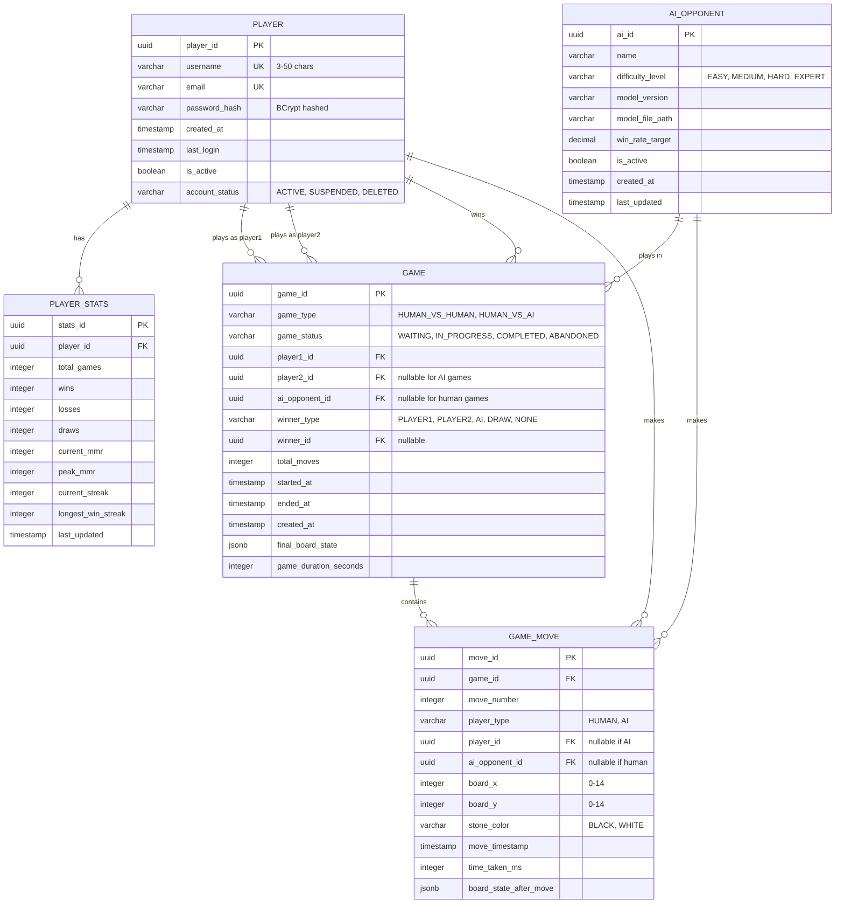

# Gomoku Database Schema (Minimal - 5 Core Tables)

## Overview
Minimal PostgreSQL schema for Gomoku supporting real-time gameplay with Redis/Kafka hybrid architecture. PostgreSQL stores **final persistence** only - active games live in Redis, events stream through Kafka.

## 🏗️ Architecture Alignment

```plaintext
Redis (Active Data)          Kafka (Event Stream)         PostgreSQL (Final Persistence)
├── Active game sessions  →  ├── game-move-made      →   ├── game (completed)
├── Matchmaking queue         └── match-created           └── game_move (replay data)
└── int[][] board cache
```

## Entity Relationship Diagram



## Table Descriptions

### 1. PLAYER
**User profiles with JWT authentication**

- **Primary Key**: `player_id` (UUID)
- **Unique Constraints**: `username`, `email`
- **Purpose**: User authentication and profile data
- **Security**: Passwords hashed with BCrypt (work factor 12)

```sql
CREATE TABLE player (
    player_id UUID PRIMARY KEY DEFAULT uuid_generate_v4(),
    username VARCHAR(50) NOT NULL UNIQUE,
    email VARCHAR(255) NOT NULL UNIQUE,
    password_hash VARCHAR(255) NOT NULL,  -- BCrypt hashed
    created_at TIMESTAMP WITH TIME ZONE DEFAULT CURRENT_TIMESTAMP,
    last_login TIMESTAMP WITH TIME ZONE,
    is_active BOOLEAN DEFAULT true,
    account_status VARCHAR(20) DEFAULT 'ACTIVE'
        CHECK (account_status IN ('ACTIVE', 'SUSPENDED', 'DELETED'))
);
```

---

### 2. PLAYER_STATS
**Player performance metrics and MMR**

- **Primary Key**: `stats_id` (UUID)
- **Foreign Key**: `player_id` → PLAYER
- **Purpose**: Ranking, matchmaking, leaderboards

```sql
CREATE TABLE player_stats (
    stats_id UUID PRIMARY KEY DEFAULT uuid_generate_v4(),
    player_id UUID NOT NULL REFERENCES player(player_id) ON DELETE CASCADE,
    total_games INTEGER DEFAULT 0 CHECK (total_games >= 0),
    wins INTEGER DEFAULT 0 CHECK (wins >= 0),
    losses INTEGER DEFAULT 0 CHECK (losses >= 0),
    draws INTEGER DEFAULT 0 CHECK (draws >= 0),
    current_mmr INTEGER DEFAULT 1000 CHECK (current_mmr >= 0),
    peak_mmr INTEGER DEFAULT 1000 CHECK (peak_mmr >= 0),
    current_streak INTEGER DEFAULT 0,
    longest_win_streak INTEGER DEFAULT 0 CHECK (longest_win_streak >= 0),
    last_updated TIMESTAMP WITH TIME ZONE DEFAULT CURRENT_TIMESTAMP,
    UNIQUE(player_id)
);
```

---

### 3. AI_OPPONENT
**AI bot configurations for Python microservice**

- **Primary Key**: `ai_id` (UUID)
- **Purpose**: PyTorch model metadata, difficulty levels

```sql
CREATE TABLE ai_opponent (
    ai_id UUID PRIMARY KEY DEFAULT uuid_generate_v4(),
    name VARCHAR(100) NOT NULL,
    difficulty_level VARCHAR(20) NOT NULL
        CHECK (difficulty_level IN ('EASY', 'MEDIUM', 'HARD', 'EXPERT')),
    model_version VARCHAR(50) NOT NULL,
    model_file_path VARCHAR(500) NOT NULL,
    win_rate_target DECIMAL(5,4) NOT NULL
        CHECK (win_rate_target >= 0 AND win_rate_target <= 1),
    is_active BOOLEAN DEFAULT true,
    created_at TIMESTAMP WITH TIME ZONE DEFAULT CURRENT_TIMESTAMP,
    last_updated TIMESTAMP WITH TIME ZONE DEFAULT CURRENT_TIMESTAMP
);
```

**Default AI Opponents:**
- Rookie Bot (EASY) - 30% win rate
- Challenger Bot (MEDIUM) - 50% win rate
- Expert Bot (HARD) - 70% win rate
- Master Bot (EXPERT) - 85% win rate

---

### 4. GAME
**Completed game records**

- **Primary Key**: `game_id` (UUID)
- **Purpose**: Final game state after Redis session completes
- **Populated by**: Kafka consumers (MatchCreatedConsumer)

```sql
CREATE TABLE game (
    game_id UUID PRIMARY KEY DEFAULT uuid_generate_v4(),
    game_type VARCHAR(20) NOT NULL
        CHECK (game_type IN ('HUMAN_VS_HUMAN', 'HUMAN_VS_AI')),
    game_status VARCHAR(20) DEFAULT 'WAITING'
        CHECK (game_status IN ('WAITING', 'IN_PROGRESS', 'COMPLETED', 'ABANDONED')),
    player1_id UUID NOT NULL REFERENCES player(player_id) ON DELETE CASCADE,
    player2_id UUID REFERENCES player(player_id) ON DELETE CASCADE,  -- NULL for AI
    ai_opponent_id UUID REFERENCES ai_opponent(ai_id) ON DELETE SET NULL,  -- NULL for PvP
    winner_type VARCHAR(20) DEFAULT 'NONE'
        CHECK (winner_type IN ('PLAYER1', 'PLAYER2', 'AI', 'DRAW', 'NONE')),
    winner_id UUID REFERENCES player(player_id) ON DELETE SET NULL,
    total_moves INTEGER DEFAULT 0 CHECK (total_moves >= 0),
    started_at TIMESTAMP WITH TIME ZONE,
    ended_at TIMESTAMP WITH TIME ZONE,
    created_at TIMESTAMP WITH TIME ZONE DEFAULT CURRENT_TIMESTAMP,
    final_board_state JSONB,  -- Final 15x15 int[][] as JSON
    game_duration_seconds INTEGER CHECK (game_duration_seconds >= 0),

    CONSTRAINT game_type_consistency CHECK (
        (game_type = 'HUMAN_VS_HUMAN' AND player2_id IS NOT NULL AND ai_opponent_id IS NULL) OR
        (game_type = 'HUMAN_VS_AI' AND player2_id IS NULL AND ai_opponent_id IS NOT NULL)
    ),
    CONSTRAINT winner_consistency CHECK (
        (winner_type = 'PLAYER1' AND winner_id = player1_id) OR
        (winner_type = 'PLAYER2' AND winner_id = player2_id) OR
        (winner_type = 'AI' AND winner_id IS NULL) OR
        (winner_type = 'DRAW' AND winner_id IS NULL) OR
        (winner_type = 'NONE' AND winner_id IS NULL)
    )
);
```

---

### 5. GAME_MOVE
**Individual move history for game replay**

- **Primary Key**: `move_id` (UUID)
- **Foreign Key**: `game_id` → GAME
- **Purpose**: Complete game replay from Kafka events
- **Populated by**: Kafka consumers (GameMovesConsumer)

```sql
CREATE TABLE game_move (
    move_id UUID PRIMARY KEY DEFAULT uuid_generate_v4(),
    game_id UUID NOT NULL REFERENCES game(game_id) ON DELETE CASCADE,
    move_number INTEGER NOT NULL CHECK (move_number > 0),
    player_type VARCHAR(20) NOT NULL
        CHECK (player_type IN ('HUMAN', 'AI')),
    player_id UUID REFERENCES player(player_id) ON DELETE CASCADE,  -- NULL if AI
    ai_opponent_id UUID REFERENCES ai_opponent(ai_id) ON DELETE CASCADE,  -- NULL if human
    board_x INTEGER NOT NULL CHECK (board_x >= 0 AND board_x < 15),
    board_y INTEGER NOT NULL CHECK (board_y >= 0 AND board_y < 15),
    stone_color VARCHAR(20) NOT NULL
        CHECK (stone_color IN ('BLACK', 'WHITE')),
    move_timestamp TIMESTAMP WITH TIME ZONE DEFAULT CURRENT_TIMESTAMP,
    time_taken_ms INTEGER CHECK (time_taken_ms >= 0),
    board_state_after_move JSONB,  -- Board snapshot after this move

    UNIQUE(game_id, move_number),
    UNIQUE(game_id, board_x, board_y),
    CONSTRAINT move_player_consistency CHECK (
        (player_type = 'HUMAN' AND player_id IS NOT NULL AND ai_opponent_id IS NULL) OR
        (player_type = 'AI' AND player_id IS NULL AND ai_opponent_id IS NOT NULL)
    )
);
```

---

## Data Flow

### Real-time Gameplay (Redis)
```plaintext
1. Player makes move
2. GameService validates against Redis session (int[][] board)
3. WebSocket broadcasts to opponent
4. Async: Kafka producer logs to game-move-made
```

### Persistence (PostgreSQL via Kafka)
```plaintext
1. Kafka consumer reads game-move-made events
2. Batch insert to game_move table
3. On game completion: Update game table with final state
4. Update player_stats (wins/losses/MMR)
```

### Game Replay
```plaintext
SELECT * FROM game_move
WHERE game_id = ?
ORDER BY move_number ASC;

-- Reconstruct entire game from moves
```

---

## Indexes

```sql
-- Player lookups
CREATE INDEX idx_player_username ON player(username);
CREATE INDEX idx_player_email ON player(email);
CREATE INDEX idx_player_active ON player(is_active);
CREATE INDEX idx_player_account_status ON player(account_status);

-- AI opponent queries
CREATE INDEX idx_ai_opponent_difficulty ON ai_opponent(difficulty_level);
CREATE INDEX idx_ai_opponent_active ON ai_opponent(is_active);

-- Player stats queries
CREATE INDEX idx_player_stats_player_id ON player_stats(player_id);
CREATE INDEX idx_player_stats_mmr ON player_stats(current_mmr);

-- Game queries
CREATE INDEX idx_game_status ON game(game_status);
CREATE INDEX idx_game_type ON game(game_type);
CREATE INDEX idx_game_player1 ON game(player1_id);
CREATE INDEX idx_game_player2 ON game(player2_id);
CREATE INDEX idx_game_ai_opponent ON game(ai_opponent_id);
CREATE INDEX idx_game_created_at ON game(created_at);
CREATE INDEX idx_game_winner ON game(winner_id);

-- Move replay queries
CREATE INDEX idx_move_game_id ON game_move(game_id);
CREATE INDEX idx_move_game_move_number ON game_move(game_id, move_number);
CREATE INDEX idx_move_board_position ON game_move(board_x, board_y);
CREATE INDEX idx_move_timestamp ON game_move(move_timestamp);
```

---

### Future analytics
- `game_analytics` - Post-game analysis
- `ai_model_performance` - AI tracking
- `player_ai_matchup` - Player vs AI stats

---

## Design Principles

1. **PostgreSQL = Cold Storage**: Only final, queryable data
2. **Redis = Hot Data**: Active games, matchmaking queue
3. **Kafka = Event Log**: Complete audit trail for replay
4. **Minimal Schema**: Only what's needed for core gameplay
5. **Extensible**: Easy to add analytics tables later

---

## Common Queries

### Get Player Stats
```sql
SELECT p.username, ps.current_mmr, ps.wins, ps.losses
FROM player p
JOIN player_stats ps ON p.player_id = ps.player_id
WHERE p.player_id = ?;
```

### Get Game History
```sql
SELECT g.*, p1.username as player1, p2.username as player2
FROM game g
JOIN player p1 ON g.player1_id = p1.player_id
LEFT JOIN player p2 ON g.player2_id = p2.player_id
WHERE g.player1_id = ? OR g.player2_id = ?
ORDER BY g.ended_at DESC
LIMIT 10;
```

### Replay Game
```sql
SELECT move_number, player_type, board_x, board_y, stone_color, move_timestamp
FROM game_move
WHERE game_id = ?
ORDER BY move_number ASC;
```

---

This minimal schema supports full gameplay while keeping PostgreSQL focused on what it does best: relational queries and historical data.
