# Gomoku Database Schema

## Overview
This document outlines the complete database schema for the Gomoku game, supporting both Human vs Human and Human vs AI gameplay with real-time matchmaking, event sourcing via Kafka, and comprehensive analytics.

## Entity Relationship Diagram

```mermaid
erDiagram
    PLAYER {
        uuid player_id PK
        string username UK
        string email UK
        string password_hash
        timestamp created_at
        timestamp last_login
        boolean is_active
        enum account_status "ACTIVE, SUSPENDED, DELETED"
    }

    PLAYER_STATS {
        uuid stats_id PK
        uuid player_id FK
        integer total_games
        integer wins
        integer losses
        integer draws
        integer current_mmr
        integer peak_mmr
        integer current_streak
        integer longest_win_streak
        timestamp last_updated
    }

    AI_OPPONENT {
        uuid ai_id PK
        string name
        enum difficulty_level "EASY, MEDIUM, HARD, EXPERT"
        string model_version
        string model_file_path
        float win_rate_target
        boolean is_active
        timestamp created_at
        timestamp last_updated
    }

    GAME {
        uuid game_id PK
        enum game_type "HUMAN_VS_HUMAN, HUMAN_VS_AI"
        enum game_status "WAITING, IN_PROGRESS, COMPLETED, ABANDONED"
        uuid player1_id FK
        uuid player2_id FK "nullable for AI games"
        uuid ai_opponent_id FK "nullable for human games"
        enum winner_type "PLAYER1, PLAYER2, AI, DRAW, NONE"
        uuid winner_id FK "nullable"
        integer total_moves
        timestamp started_at
        timestamp ended_at
        timestamp created_at
        json final_board_state
        integer game_duration_seconds
    }

    GAME_MOVE {
        uuid move_id PK
        uuid game_id FK
        integer move_number
        enum player_type "HUMAN, AI"
        uuid player_id FK "nullable if AI"
        uuid ai_opponent_id FK "nullable if human"
        integer board_x
        integer board_y
        enum stone_color "BLACK, WHITE"
        timestamp move_timestamp
        integer time_taken_ms
        json board_state_after_move
    }

    MATCHMAKING_QUEUE {
        uuid queue_id PK
        uuid player_id FK
        enum preferred_opponent "HUMAN_ONLY, AI_ONLY, ANY"
        enum ai_difficulty "EASY, MEDIUM, HARD, EXPERT"
        integer mmr_min
        integer mmr_max
        timestamp queued_at
        enum queue_status "WAITING, MATCHED, EXPIRED, CANCELLED"
        timestamp expires_at
    }

    GAME_SESSION {
        uuid session_id PK
        uuid game_id FK
        uuid player_id FK
        string websocket_session_id
        timestamp connected_at
        timestamp disconnected_at
        boolean is_active
        integer reconnect_count
    }

    KAFKA_EVENT_LOG {
        uuid event_id PK
        string topic_name
        string event_type
        uuid related_game_id FK "nullable"
        uuid related_player_id FK "nullable"
        json event_payload
        timestamp event_timestamp
        string kafka_partition
        bigint kafka_offset
        enum processing_status "PENDING, PROCESSED, FAILED"
    }

    GAME_ANALYTICS {
        uuid analytics_id PK
        uuid game_id FK
        enum game_outcome "PLAYER1_WIN, PLAYER2_WIN, AI_WIN, DRAW, ABANDONED"
        integer game_length_moves
        integer average_move_time_ms
        integer player1_total_time_ms
        integer player2_total_time_ms
        json opening_moves_pattern
        json winning_pattern "nullable"
        boolean had_disconnections
        timestamp analyzed_at
    }

    LEADERBOARD {
        uuid leaderboard_id PK
        uuid player_id FK
        integer current_rank
        integer previous_rank
        integer mmr_score
        integer games_played_season
        integer wins_season
        float win_rate_season
        timestamp last_rank_update
        string season_identifier
    }

    AI_MODEL_PERFORMANCE {
        uuid performance_id PK
        uuid ai_opponent_id FK
        string model_version
        integer games_played
        integer games_won
        float actual_win_rate
        float target_win_rate
        integer total_moves_made
        float average_thinking_time_ms
        timestamp performance_period_start
        timestamp performance_period_end
        json performance_metrics
    }

    PLAYER_AI_MATCHUP {
        uuid matchup_id PK
        uuid player_id FK
        uuid ai_opponent_id FK
        integer games_played
        integer player_wins
        integer ai_wins
        integer draws
        float player_win_rate
        timestamp last_game_date
        timestamp first_game_date
    }

    %% Relationships
    PLAYER ||--o{ PLAYER_STATS : has
    PLAYER ||--o{ GAME : "plays as player1"
    PLAYER ||--o{ GAME : "plays as player2"
    PLAYER ||--o{ GAME : "wins"
    PLAYER ||--o{ GAME_MOVE : makes
    PLAYER ||--o{ MATCHMAKING_QUEUE : queues
    PLAYER ||--o{ GAME_SESSION : participates
    PLAYER ||--o{ LEADERBOARD : ranked
    PLAYER ||--o{ PLAYER_AI_MATCHUP : "plays against AI"

    AI_OPPONENT ||--o{ GAME : "plays in"
    AI_OPPONENT ||--o{ GAME_MOVE : makes
    AI_OPPONENT ||--o{ AI_MODEL_PERFORMANCE : "performance tracked"
    AI_OPPONENT ||--o{ PLAYER_AI_MATCHUP : "matches against players"

    GAME ||--o{ GAME_MOVE : contains
    GAME ||--o{ GAME_SESSION : has
    GAME ||--o{ KAFKA_EVENT_LOG : generates
    GAME ||--o{ GAME_ANALYTICS : analyzed

    MATCHMAKING_QUEUE }o--|| PLAYER : belongs_to
    KAFKA_EVENT_LOG }o--o| GAME : relates_to
    KAFKA_EVENT_LOG }o--o| PLAYER : relates_to
```



## Table Descriptions

### Core Entities

#### PLAYER
Central user entity managing authentication and account information.
- **Primary Key**: `player_id` (UUID)
- **Unique Constraints**: `username`, `email`
- **Key Features**: Account status tracking, login history

#### AI_OPPONENT
Represents AI opponents with different difficulty levels and ML model configurations.
- **Primary Key**: `ai_id` (UUID)
- **Key Features**: Model versioning, target win rates, PyTorch/DJL integration support

#### GAME
Core game entity supporting both Human vs Human and Human vs AI matches.
- **Primary Key**: `game_id` (UUID)
- **Key Features**: Flexible player/AI assignment, board state storage, comprehensive game tracking

#### GAME_MOVE
Individual moves with support for both human and AI players.
- **Primary Key**: `move_id` (UUID)
- **Key Features**: Move timing, board state snapshots, dual player type support

### Matchmaking & Sessions

#### MATCHMAKING_QUEUE
Handles player queuing with MMR ranges and opponent preferences.
- **Primary Key**: `queue_id` (UUID)
- **Key Features**: MMR-based matching, opponent type preferences, queue expiration

#### GAME_SESSION
WebSocket session tracking for real-time connectivity.
- **Primary Key**: `session_id` (UUID)
- **Key Features**: Connection tracking, reconnection counting, session lifecycle

### Analytics & Performance

#### PLAYER_STATS
Comprehensive player statistics including MMR and performance metrics.
- **Primary Key**: `stats_id` (UUID)
- **Key Features**: MMR tracking, streak counting, comprehensive win/loss records

#### KAFKA_EVENT_LOG
Event sourcing for all Kafka messages supporting audit trails and replay.
- **Primary Key**: `event_id` (UUID)
- **Key Features**: Topic tracking, partition/offset storage, processing status

#### GAME_ANALYTICS
Processed game insights derived from Kafka event streams.
- **Primary Key**: `analytics_id` (UUID)
- **Key Features**: Pattern analysis, timing metrics, outcome classification

#### LEADERBOARD
Seasonal rankings with MMR-based positioning.
- **Primary Key**: `leaderboard_id` (UUID)
- **Key Features**: Rank change tracking, seasonal performance, win rate calculations

#### AI_MODEL_PERFORMANCE
Tracking AI model effectiveness and performance metrics.
- **Primary Key**: `performance_id` (UUID)
- **Key Features**: Win rate analysis, thinking time metrics, model comparison

#### PLAYER_AI_MATCHUP
Historical performance tracking between specific players and AI opponents.
- **Primary Key**: `matchup_id` (UUID)
- **Key Features**: Head-to-head statistics, difficulty progression tracking

## Key Design Decisions

### Hybrid Game Support
- Games support both Human vs Human and Human vs AI through nullable foreign keys
- Move tracking accommodates both player types with `player_type` enum
- Winner determination covers all scenarios (players, AI, draws)

### Event Sourcing Integration
- `KAFKA_EVENT_LOG` stores all Kafka events for replay and audit capabilities
- Events link back to games and players for comprehensive tracking
- Supports hybrid architecture with immediate and asynchronous processing

### Real-time Architecture
- `GAME_SESSION` manages WebSocket connections and reconnections
- Board state stored as JSON for real-time updates and historical analysis
- Move timing captured for performance analysis

### AI Model Management
- `AI_OPPONENT` stores model metadata for PyTorch/DJL integration
- Performance tracking enables continuous model evaluation
- Version control supports model updates and A/B testing

### Scalable Analytics
- Comprehensive statistics at multiple levels (player, game, AI, matchups)
- JSON fields for flexible data storage and future extensibility
- Kafka integration for real-time analytics processing

## Indexes and Performance Considerations

### Recommended Indexes
```sql
-- Player lookups
CREATE INDEX idx_player_username ON PLAYER(username);
CREATE INDEX idx_player_email ON PLAYER(email);
CREATE INDEX idx_player_active ON PLAYER(is_active);

-- Game queries
CREATE INDEX idx_game_status ON GAME(game_status);
CREATE INDEX idx_game_type ON GAME(game_type);
CREATE INDEX idx_game_player1 ON GAME(player1_id);
CREATE INDEX idx_game_player2 ON GAME(player2_id);
CREATE INDEX idx_game_created_at ON GAME(created_at);

-- Move queries
CREATE INDEX idx_move_game_id ON GAME_MOVE(game_id);
CREATE INDEX idx_move_number ON GAME_MOVE(game_id, move_number);

-- Matchmaking performance
CREATE INDEX idx_queue_status ON MATCHMAKING_QUEUE(queue_status);
CREATE INDEX idx_queue_mmr ON MATCHMAKING_QUEUE(mmr_min, mmr_max);

-- Analytics and leaderboards
CREATE INDEX idx_leaderboard_season ON LEADERBOARD(season_identifier);
CREATE INDEX idx_leaderboard_rank ON LEADERBOARD(current_rank);
CREATE INDEX idx_analytics_game ON GAME_ANALYTICS(game_id);

-- Kafka event processing
CREATE INDEX idx_kafka_topic ON KAFKA_EVENT_LOG(topic_name);
CREATE INDEX idx_kafka_status ON KAFKA_EVENT_LOG(processing_status);
CREATE INDEX idx_kafka_timestamp ON KAFKA_EVENT_LOG(event_timestamp);
```

## Future Extensibility

### Tournament Support
The schema can be extended with:
- `TOURNAMENT` table for organized competitions
- `TOURNAMENT_BRACKET` for elimination rounds
- Modified `GAME` to reference tournaments

### Team Play
Can be extended with:
- `TEAM` and `TEAM_MEMBER` tables
- Team-based statistics and rankings
- Collaborative game modes

### Advanced AI Features
- Model training data collection via expanded event logging
- A/B testing framework for model comparison
- Reinforcement learning feedback loops

This schema provides a solid foundation for the current Gomoku requirements while maintaining flexibility for future enhancements.