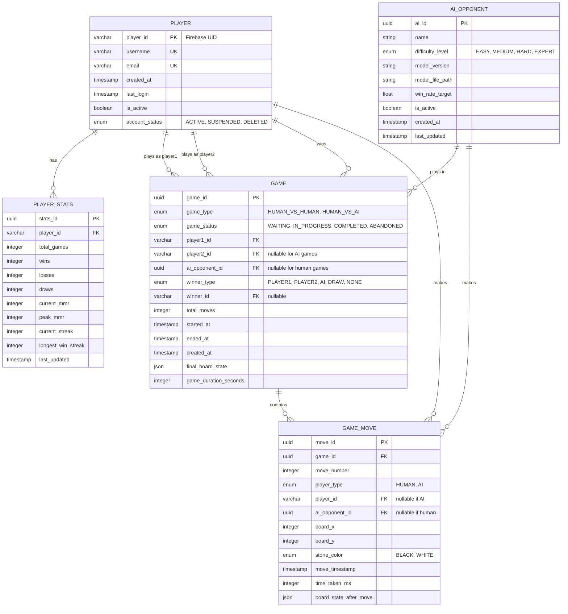

# Gomoku Database Schema (Minimal - 5 Core Tables)

## Overview
Minimal PostgreSQL schema for Gomoku supporting real-time gameplay with Redis/Kafka hybrid architecture. PostgreSQL stores **final persistence** only - active games live in Redis, events stream through Kafka.

## 🏗️ Architecture Alignment

```plaintext
Redis (Active Data)          Kafka (Event Stream)         PostgreSQL (Final Persistence)
├── Active game sessions  →  ├── game-move-made      →   ├── game (completed)
├── Matchmaking queue         └── match-created           └── game_move (replay data)
└── int[][] board cache
```

## Entity Relationship Diagram



## Table Descriptions

### 1. PLAYER
**User profiles linked to Firebase Authentication**

- **Primary Key**: `player_id` (VARCHAR) - Firebase UID
- **Unique Constraints**: `username`, `email`
- **Purpose**: Application-specific user data (no password storage)

```sql
CREATE TABLE player (
    player_id VARCHAR(255) PRIMARY KEY,  -- Firebase UID
    username VARCHAR(50) NOT NULL UNIQUE,
    email VARCHAR(255) NOT NULL UNIQUE,
    created_at TIMESTAMP WITH TIME ZONE DEFAULT CURRENT_TIMESTAMP,
    last_login TIMESTAMP WITH TIME ZONE,
    is_active BOOLEAN DEFAULT true,
    account_status account_status_enum DEFAULT 'ACTIVE'
);
```

---

### 2. PLAYER_STATS
**Player performance metrics and MMR**

- **Primary Key**: `stats_id` (UUID)
- **Foreign Key**: `player_id` → PLAYER
- **Purpose**: Ranking, matchmaking, leaderboards

```sql
CREATE TABLE player_stats (
    stats_id UUID PRIMARY KEY DEFAULT uuid_generate_v4(),
    player_id VARCHAR(255) NOT NULL REFERENCES player(player_id) ON DELETE CASCADE,
    total_games INTEGER DEFAULT 0,
    wins INTEGER DEFAULT 0,
    losses INTEGER DEFAULT 0,
    draws INTEGER DEFAULT 0,
    current_mmr INTEGER DEFAULT 1000,
    peak_mmr INTEGER DEFAULT 1000,
    current_streak INTEGER DEFAULT 0,
    longest_win_streak INTEGER DEFAULT 0,
    last_updated TIMESTAMP WITH TIME ZONE DEFAULT CURRENT_TIMESTAMP,
    UNIQUE(player_id)
);
```

---

### 3. AI_OPPONENT
**AI bot configurations for Python microservice**

- **Primary Key**: `ai_id` (UUID)
- **Purpose**: PyTorch model metadata, difficulty levels

```sql
CREATE TABLE ai_opponent (
    ai_id UUID PRIMARY KEY DEFAULT uuid_generate_v4(),
    name VARCHAR(100) NOT NULL,
    difficulty_level difficulty_level_enum NOT NULL,
    model_version VARCHAR(50) NOT NULL,
    model_file_path VARCHAR(500) NOT NULL,
    win_rate_target DECIMAL(5,4) NOT NULL,
    is_active BOOLEAN DEFAULT true,
    created_at TIMESTAMP WITH TIME ZONE DEFAULT CURRENT_TIMESTAMP,
    last_updated TIMESTAMP WITH TIME ZONE DEFAULT CURRENT_TIMESTAMP
);
```

**Default AI Opponents:**
- Rookie Bot (EASY) - 30% win rate
- Challenger Bot (MEDIUM) - 50% win rate
- Expert Bot (HARD) - 70% win rate
- Master Bot (EXPERT) - 85% win rate

---

### 4. GAME
**Completed game records**

- **Primary Key**: `game_id` (UUID)
- **Purpose**: Final game state after Redis session completes
- **Populated by**: Kafka consumers (MatchCreatedConsumer)

```sql
CREATE TABLE game (
    game_id UUID PRIMARY KEY DEFAULT uuid_generate_v4(),
    game_type game_type_enum NOT NULL,
    game_status game_status_enum DEFAULT 'WAITING',
    player1_id VARCHAR(255) NOT NULL REFERENCES player(player_id),
    player2_id VARCHAR(255) REFERENCES player(player_id),  -- NULL for AI
    ai_opponent_id UUID REFERENCES ai_opponent(ai_id),    -- NULL for PvP
    winner_type winner_type_enum DEFAULT 'NONE',
    winner_id VARCHAR(255) REFERENCES player(player_id),
    total_moves INTEGER DEFAULT 0,
    started_at TIMESTAMP WITH TIME ZONE,
    ended_at TIMESTAMP WITH TIME ZONE,
    created_at TIMESTAMP WITH TIME ZONE DEFAULT CURRENT_TIMESTAMP,
    final_board_state JSONB,  -- Final 15x15 int[][] as JSON
    game_duration_seconds INTEGER,

    CONSTRAINT game_type_consistency CHECK (
        (game_type = 'HUMAN_VS_HUMAN' AND player2_id IS NOT NULL AND ai_opponent_id IS NULL) OR
        (game_type = 'HUMAN_VS_AI' AND player2_id IS NULL AND ai_opponent_id IS NOT NULL)
    )
);
```

---

### 5. GAME_MOVE
**Individual move history for game replay**

- **Primary Key**: `move_id` (UUID)
- **Foreign Key**: `game_id` → GAME
- **Purpose**: Complete game replay from Kafka events
- **Populated by**: Kafka consumers (GameMovesConsumer)

```sql
CREATE TABLE game_move (
    move_id UUID PRIMARY KEY DEFAULT uuid_generate_v4(),
    game_id UUID NOT NULL REFERENCES game(game_id) ON DELETE CASCADE,
    move_number INTEGER NOT NULL,
    player_type player_type_enum NOT NULL,
    player_id VARCHAR(255) REFERENCES player(player_id),      -- NULL if AI
    ai_opponent_id UUID REFERENCES ai_opponent(ai_id),       -- NULL if human
    board_x INTEGER NOT NULL CHECK (board_x >= 0 AND board_x < 15),
    board_y INTEGER NOT NULL CHECK (board_y >= 0 AND board_y < 15),
    stone_color stone_color_enum NOT NULL,
    move_timestamp TIMESTAMP WITH TIME ZONE DEFAULT CURRENT_TIMESTAMP,
    time_taken_ms INTEGER,
    board_state_after_move JSONB,  -- Board snapshot after this move

    UNIQUE(game_id, move_number),
    UNIQUE(game_id, board_x, board_y)
);
```

---

## Data Flow

### Real-time Gameplay (Redis)
```plaintext
1. Player makes move
2. GameService validates against Redis session (int[][] board)
3. WebSocket broadcasts to opponent
4. Async: Kafka producer logs to game-move-made
```

### Persistence (PostgreSQL via Kafka)
```plaintext
1. Kafka consumer reads game-move-made events
2. Batch insert to game_move table
3. On game completion: Update game table with final state
4. Update player_stats (wins/losses/MMR)
```

### Game Replay
```plaintext
SELECT * FROM game_move
WHERE game_id = ?
ORDER BY move_number ASC;

-- Reconstruct entire game from moves
```

---

## Indexes

```sql
-- Player lookups (Firebase UID, username)
CREATE INDEX idx_player_username ON player(username);
CREATE INDEX idx_player_email ON player(email);
CREATE INDEX idx_player_active ON player(is_active);

-- Game queries
CREATE INDEX idx_game_status ON game(game_status);
CREATE INDEX idx_game_player1 ON game(player1_id);
CREATE INDEX idx_game_created_at ON game(created_at);

-- Move replay queries
CREATE INDEX idx_move_game_id ON game_move(game_id);
CREATE INDEX idx_move_game_move_number ON game_move(game_id, move_number);

-- Stats queries
CREATE INDEX idx_player_stats_mmr ON player_stats(current_mmr);
```

---

## What's NOT in PostgreSQL

### ❌ Removed Tables (Handled by Redis/Kafka)
- `matchmaking_queue` → Redis sorted set (ZADD/ZPOPMIN)
- `game_session` → Redis cached sessions
- `kafka_event_log` → Kafka IS the event log
- `leaderboard` → Feature not implemented yet

### ⏸️ Deferred Tables (Future Analytics)
- `game_analytics` - Post-game analysis
- `ai_model_performance` - AI tracking
- `player_ai_matchup` - Player vs AI stats

---

## Design Principles

1. **PostgreSQL = Cold Storage**: Only final, queryable data
2. **Redis = Hot Data**: Active games, matchmaking queue
3. **Kafka = Event Log**: Complete audit trail for replay
4. **Minimal Schema**: Only what's needed for core gameplay
5. **Extensible**: Easy to add analytics tables later

---

## Common Queries

### Get Player Stats
```sql
SELECT p.username, ps.current_mmr, ps.wins, ps.losses
FROM player p
JOIN player_stats ps ON p.player_id = ps.player_id
WHERE p.player_id = ?;
```

### Get Game History
```sql
SELECT g.*, p1.username as player1, p2.username as player2
FROM game g
JOIN player p1 ON g.player1_id = p1.player_id
LEFT JOIN player p2 ON g.player2_id = p2.player_id
WHERE g.player1_id = ? OR g.player2_id = ?
ORDER BY g.ended_at DESC
LIMIT 10;
```

### Replay Game
```sql
SELECT move_number, player_type, board_x, board_y, stone_color, move_timestamp
FROM game_move
WHERE game_id = ?
ORDER BY move_number ASC;
```

---

This minimal schema supports full gameplay while keeping PostgreSQL focused on what it does best: relational queries and historical data.
